# Projeto Final

O projeto final foi dividido em duas etapas:

- Análise do dataset

- Implementação da CNN

## Análise do dataset

Durante a análise do Dataset, a equipe buscou trabalhar na organização das imagens e compreender melhor a estrutura do Dataset. Foi nesse momento que identificamos que o Dataset não possuía máscaras para o grupo de validação, apenas no grupo de treinamento. Foi também nessa etapa que constatamos que todas as máscaras possuíam uma convenção de nomenclatura (_mask) e uma extensão de arquivo (.png) diferente das imagens de satélite, também presentes no mesmo conjunto (_sat e .jpg).

Para além de questões organizacionais, algumas análises referentes às imagens e suas singularidades foram realizadas com o intuito de compreender, melhor, a qualidade do Dataset com o qual trabalhávamos:

- Verificação da integridade dos arquivos: Verificando se todas as imagens listadas estão presentes nos arquivos.
- Consistência dos metadados: Análise detalhada para garantir que os metadados estavam precisos e consistentes.
- Qualidade das imagens: Cada imagem foi cuidadosamente inspecionada para assegurar sua eficácia no treinamento do modelo.
- Detecção de duplicatas: Foi realizada uma busca minuciosa por duplicatas que pudessem interferir no desempenho do modelo.

#### Imagens do dataset
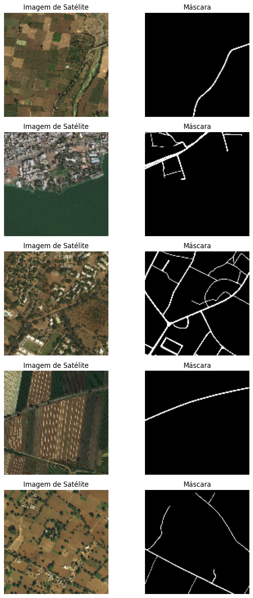

## U-Net

Nessa etapa, a equipe buscou métodos e modelos já existentes na literatura para trabalhar sobre seus resultados. O objetivo era trazer sugestões de melhorias e facilitar o processo de tratamento e treinamento, a fim de causar mudanças significativas no modelo já existente.

#### Estrutura da rede

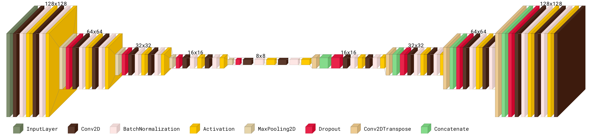

A estrutura da arquitetura da Rede Neural Convolucional foi plotada utilizando a biblioteca [Visualkeras](https://github.com/paulgavrikov/visualkeras/tree/master?tab=readme-ov-file).

#### Gráfico de perda e acurácia

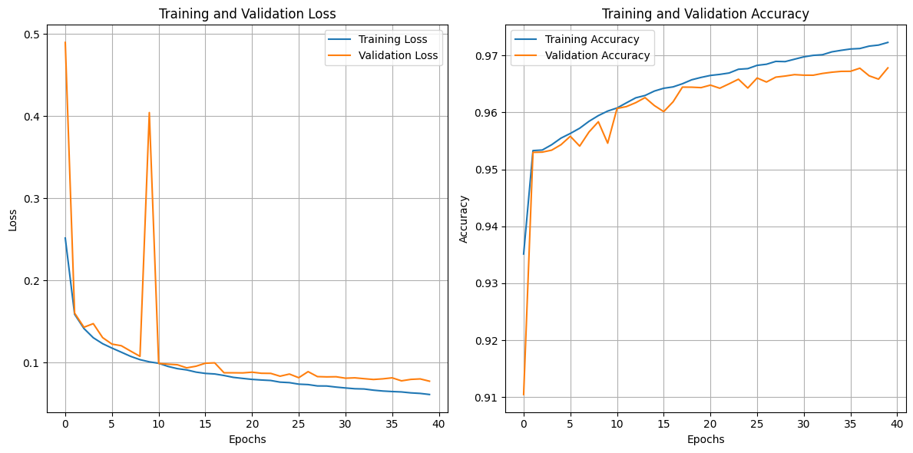

## Resultados

#### Testes com modelo para validação

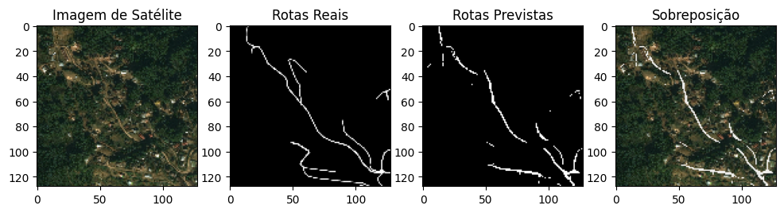
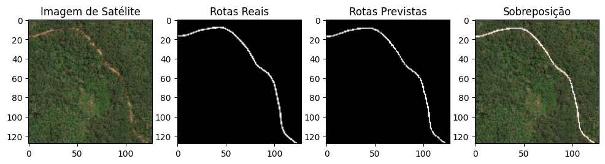
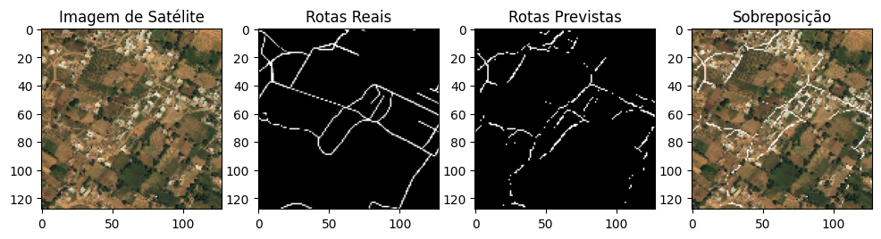
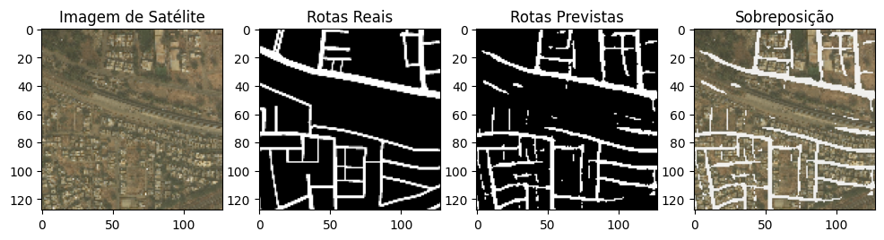
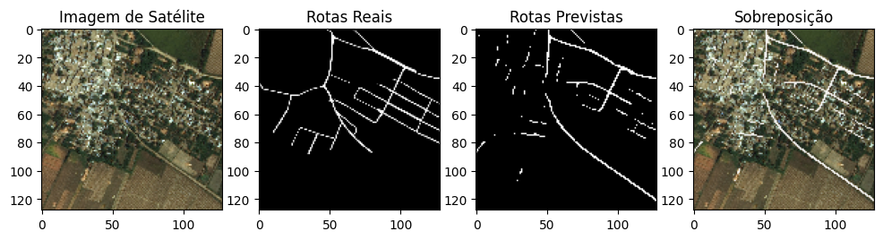

#### Testes

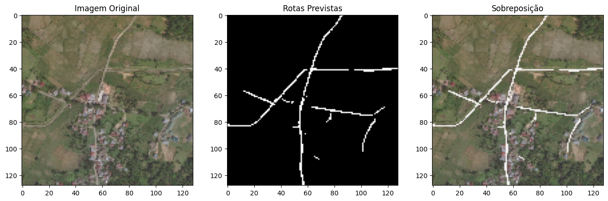
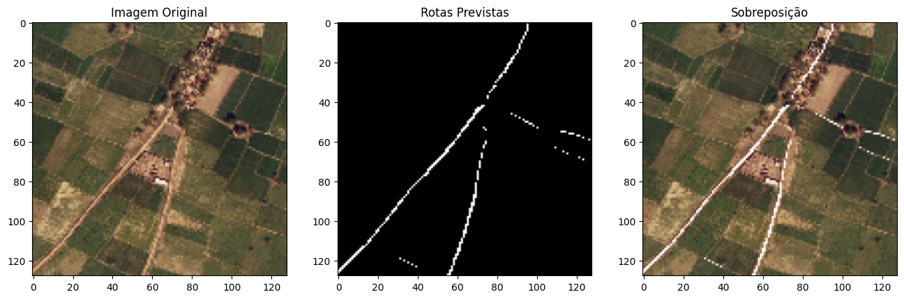
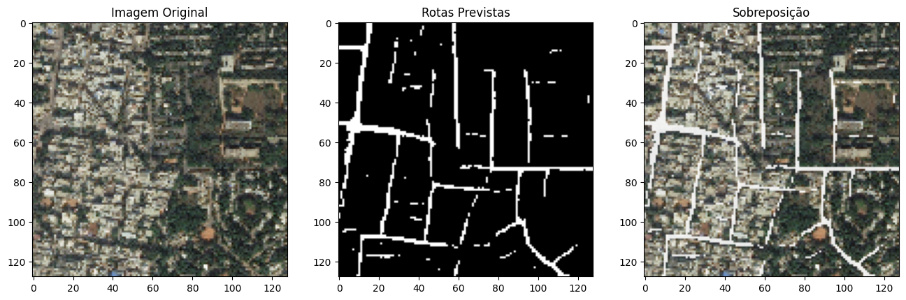
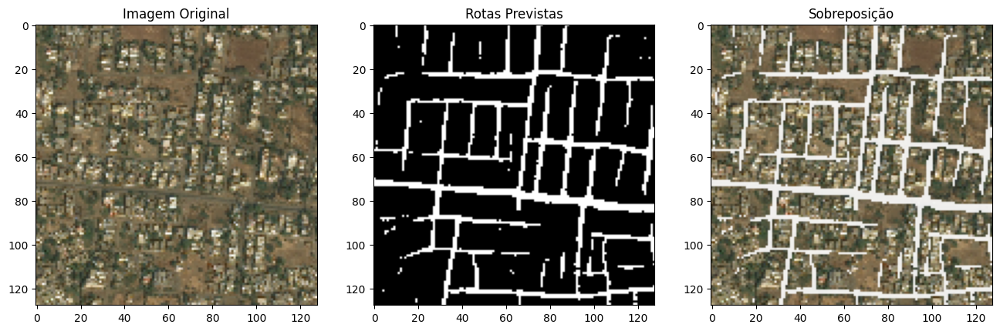
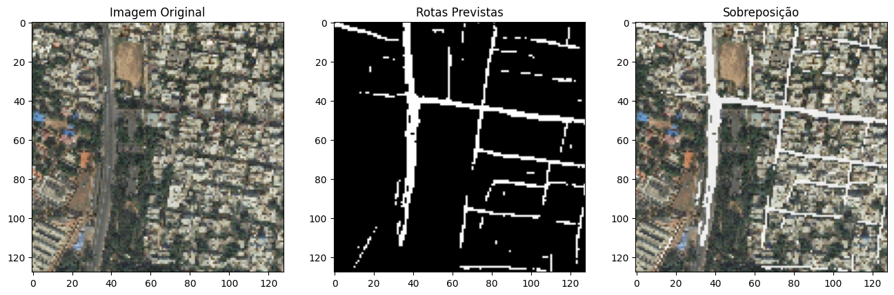
